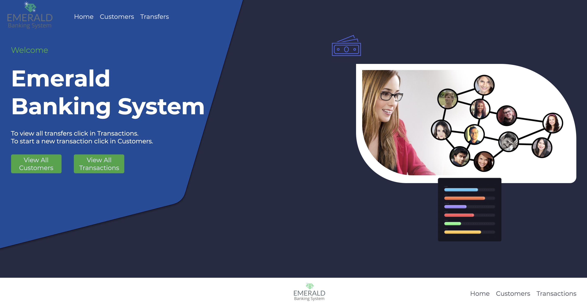
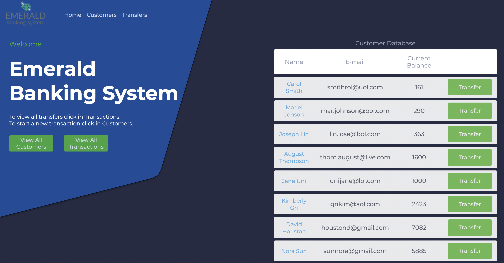
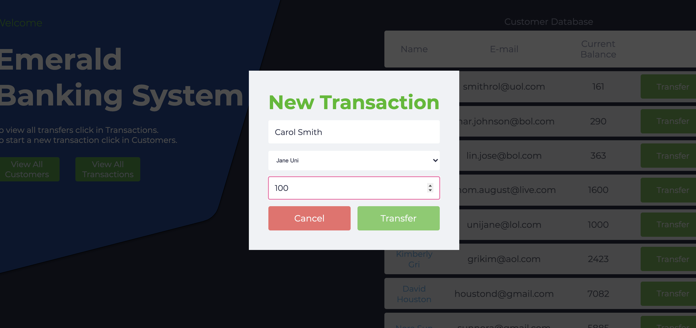
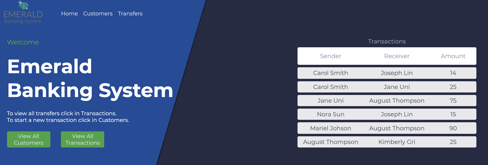

# TheSparksFoundation
<h1 align="center"></h1>

Banking System created as part of the first task for the summer internship at The Sparks Foundation

The website was hosted on <a href="http://heroku.com" target="_blank">Heroku</a> and can be accessed by clicling <a href="http://emeraldbank.herokuapp.com" target="_blank">here</a>.

<h3>:closed_book: About</h3>

The webpage has 2 databases one with the Customers details and the other with transfers made by them and between them

The customer page shows the customer table with their names, emails and current balance.

It is also in this page that it is possible to see all the transfers made by one single customer and create a new transfer

The transfer button activates a modal that shows on top of the page so the user can choose the customer to transfer to and the amount

When the transfer is made, both tables are updated and the customer table is shown again with the updated current balances.

In the transactions page it is possible to see all the transfers made between the customers

<h3>:computer: Layout</h3>

It has some features of a responsive layout. Measure unit is mostly rem to facilitate that

Is is also good for accessibility because the forms have label to facilitate users with screen readers.

For a better layout, the labels are not shown in the screen.

<h3 align="center" style="color: blue;">The home page</h3>

<h3 align="center" style="color: blue;">Customer Batabase</h3>

<h3 align="center" style="color: blue;">Modal to add a new transfer</h3>

<h3 align="center" style="color: blue;">Transactions Table</h3>

<h3>:sunrise: Technologies Used</h3>

The project was developed using the following technologies:

<code></code>
<code></code>
<code></code>
<code></code>
<code></code>
<code></code>
<code></code>
