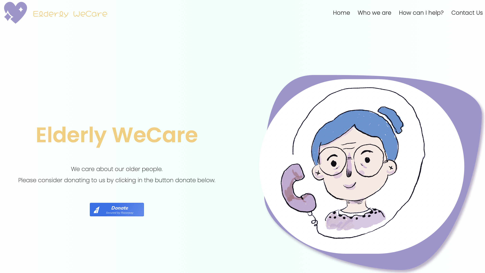
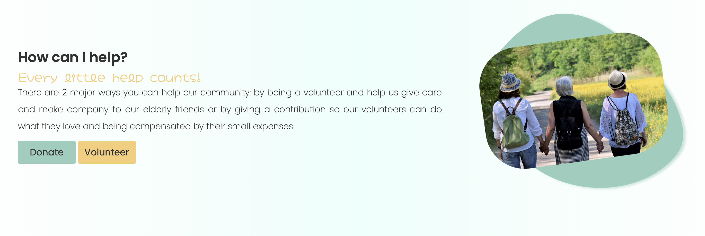
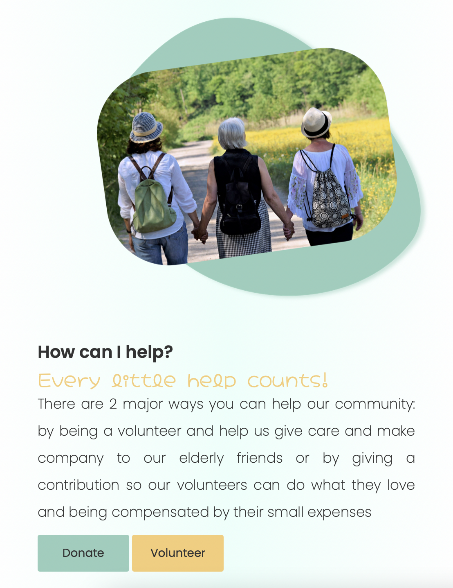
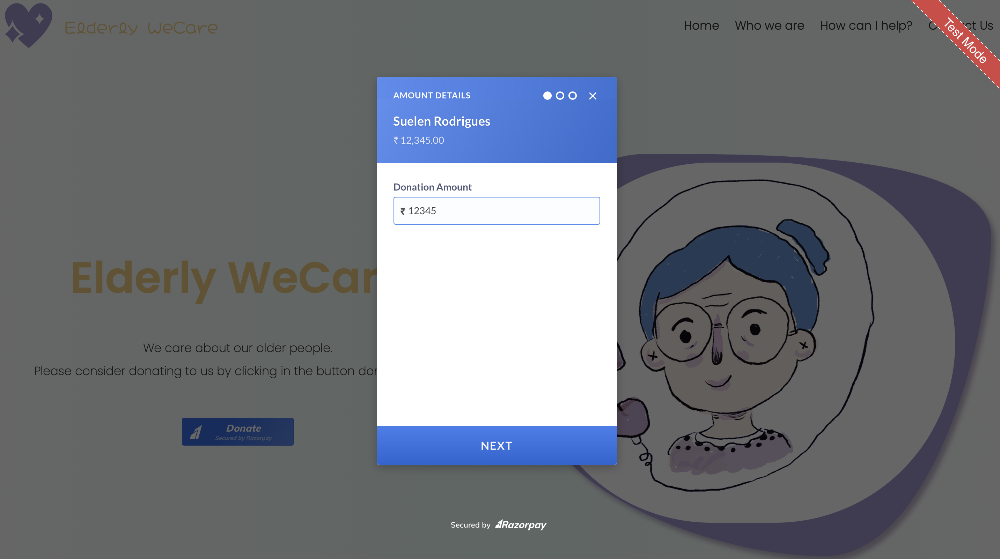

# TheSparksFoundation
<h1 align="center"></h1>

NGO Website with donation payment gateway created as part of the second task for the summer internship at The Sparks Foundation

The website was hosted on <a href="http://heroku.com" target="_blank">Heroku</a> and can be accessed by clicling <a href="https://elderly-we-care.herokuapp.com" target="_blank">here</a>.

<h3>:closed_book: About</h3>

The webpage is static and some information were created to add more reality to the project.

The user can navigate the website to learn more about the NGO.

A donate button was enabled thanks to <a href="https://razorpay.com">Razor Pay</a>

By clicink in the button the user can choose the amount to donate and insert personal information.

In order to test the payment gateway, the option UPI ID can be tested. UPI ID: success@razorpay or failure@razorpay.

After completion, if successful, a thank you message is shown and the user receives an e-mail receipt.

<h3>:computer: Layout</h3>

It has some features of a responsive layout. Measure unit is mostly rem to facilitate that

Is is also good for accessibility because the forms have label to facilitate users with screen readers.

For a better layout, the labels are not shown in the screen.

<h3 align="center" style="color: blue;">The Main Section</h3>

<h3 align="center" style="color: blue;">Who we are section</h3>

<h3 align="center" style="color: blue;">How Can I help section</h3>

<h3 align="center" style="color: blue;">Responsive</h3>

<h3 align="center" style="color: blue;">Payment Gateway</h3>

<h3>:sunrise: Technologies Used</h3>

The project was developed using the following technologies:

<code></code>
<code></code>
<code></code>
<code></code>
<code></code>
<code></code>
